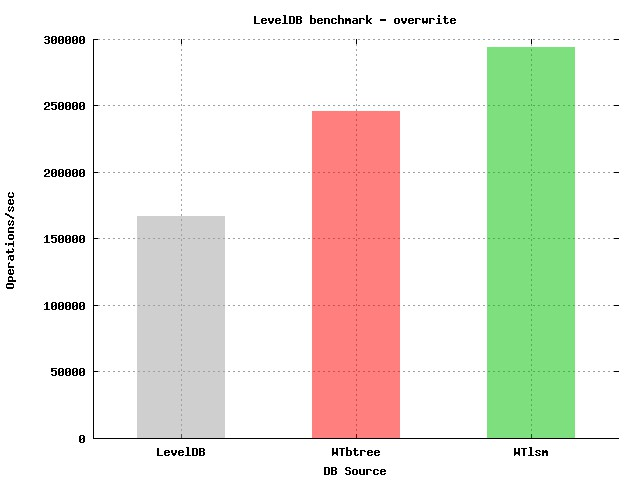
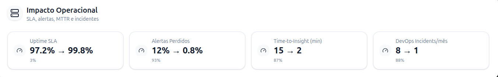

# WiredTiger: Motor LSM no MongoDB e seu impacto na Modernização de Arquiteturas de Dados

## Sumário
1. [Introdução](#introdução)
2. [Arquitetura WiredTiger](#arquitetura-wiredtiger)
3. [Comparação com Engines Tradicionais](#comparação-com-engines-tradicionais)
4. [Evolução no MongoDB](#evolução-no-mongodb)
5. [Benefícios Práticos](#benefícios-práticos)
5.1. [Exemplificando Casos de Uso](#exemplificando-casos-de-uso)
6. [Conclusão](#conclusão)
7. [Referências](#referências)

---

## Introdução

Nas últimas décadas, o mundo dos bancos de dados passou por uma transformação profunda, ainda que muitas vezes silenciosa. Nos anos 1970 e 1980, os storage engines baseados em B-Tree dominavam o cenário. Motores como InnoDB e MyISAM se tornaram referência de confiabilidade e desempenho, especialmente em workloads focados em leitura, que eram a realidade da maioria das aplicações empresariais da época. Eles estabeleciam a base de como os dados eram armazenados e consultados, em um contexto onde atualizações eram mais pontuais e o custo de armazenamento era alto.

Com a virada do século XXI, porém, o cenário mudou drasticamente. O crescimento explosivo do volume de dados com a web trouxe novos desafios. Além disso, as aplicações modernas passaram a exigir não só leituras rápidas, mas também alta taxa de escrita, processamento em tempo real e escalabilidade horizontal. Foi nesse ambiente que surgiu uma nova abordagem: os Log-Structured Merge Trees (LSM), marcando uma verdadeira mudança de paradigma no armazenamento de dados.

### Evolução dos Storage Engines: Uma Perspectiva Histórica


* 1980–1990: os B-Trees eram perfeitos para o contexto da época. O espaço de armazenamento era caro e limitado, e os dados eram consultados com muito mais frequência do que atualizados. O design desses engines refletia exatamente essa realidade: priorizar a leitura e economizar espaço.

* 1990–2000: vieram as primeiras melhorias incrementais. Os B-Trees ganharam compressão, índices mais eficientes e melhores mecanismos de concorrência. Ainda assim, sua estrutura de base continuava mais otimizada para leitura do que para escrita, o que impunha limites.

* 2010 em diante: começa a era dos LSM engines, com soluções como BigTable, Cassandra, LevelDB e WiredTiger. Diferente dos B-Trees, esses motores nasceram já voltados para big data, sistemas distribuídos e aplicações web em larga escala. Eles inverteram a lógica: em vez de priorizar leituras ocasionais, foram pensados para lidar com cargas intensivas de escrita e crescimento massivo dos dados.

### Por que MongoDB Adotou WiredTiger?

A decisão do MongoDB de adotar o WiredTiger em 2014 não foi meramente técnica, mas estratégica, refletindo uma compreensão profunda das limitações inerentes ao motor MMAPv1 e das demandas emergentes do mercado de bancos de dados NoSQL.


O MMAPv1, motor original do MongoDB, apresentava limitações críticas que se tornaram cada vez mais evidentes conforme as aplicações cresciam em escala e complexidade. O sistema de locking em nível de database criava gargalos significativos em ambientes de alta concorrência, onde múltiplas operações simultâneas eram essenciais para manter a performance. Esta limitação era particularmente problemática em aplicações web modernas, onde centenas ou milhares de usuários simultâneos são a norma, não a exceção.

A ausência de compressão nativa no MMAPv1 representava outro desafio substancial. Em uma era onde o volume de dados cresce exponencialmente, a capacidade de reduzir significativamente o footprint de armazenamento não é apenas uma conveniência, mas uma necessidade econômica. Organizações enfrentavam custos crescentes de infraestrutura e storage, especialmente em ambientes cloud onde o armazenamento é precificado por volume utilizado.

O WiredTiger emergiu como uma solução elegante para esses desafios, oferecendo locking em nível de documento, compressão nativa com múltiplos algoritmos, e uma arquitetura LSM otimizada para write-heavy workloads. Esta combinação de características não apenas resolveu as limitações técnicas do MMAPv1, mas também posicionou o MongoDB para competir efetivamente em mercados onde performance de escrita e eficiência de storage são critérios decisivos.

---

## Arquitetura WiredTiger

### Visão Geral da Arquitetura LSM

A arquitetura do WiredTiger é baseada em LSM Trees (Log-Structured Merge Trees), que otimizam a escrita em disco e a leitura eficiente de grandes volumes de dados. Quando uma aplicação envia uma requisição de escrita, os dados inicialmente são direcionados para um cache em memória, conhecido como MemTable. Enquanto houver espaço disponível no cache, os dados permanecem na memória, garantindo baixa latência nas operações de escrita.

Quando o cache atinge sua capacidade máxima, os dados são descarregados para o nível 0 (L0) do armazenamento persistente, formando arquivos SSTables imutáveis. Esses arquivos passam por um processo de compaction em segundo plano, onde são mesclados e reorganizados em níveis superiores (L1, L2 … LN), garantindo que os dados permaneçam ordenados e reduzindo o overhead de leitura.

Além disso, o WiredTiger mantém processos de eviction, que liberam espaço no cache quando necessário, e checkpoints periódicos, que garantem a consistência e durabilidade dos dados gravados no disco. Todos os níveis finais de SSTables são armazenados em arquivos comprimidos, junto de índices e metadados, formando a camada persistente do sistema.

Essa abordagem permite que o WiredTiger combine alta performance em escrita com eficiência de leitura, mantendo a durabilidade e organização dos dados de forma escalável.

### Fluxo de Escrita Detalhado


### Estrutura de Dados LSM

**Componentes Principais:**

1. **MemTable**: Estrutura em memória (skip list) para escritas rápidas
2. **SSTables**: Arquivos imutáveis ordenados no disco
3. **Compaction**: Processo de merge e reorganização
4. **Checkpoint**: Persistência consistente de dados


---

## Comparação com Engines Tradicionais

### Tabela Comparativa Detalhada

| Aspecto | WiredTiger (LSM) | InnoDB (B-Tree) | MyISAM (B-Tree) |
|---------|------------------|------------------|------------------|
| **Estrutura Principal** | Log-Structured Merge Tree | B+ Tree | B-Tree |
| **Otimização** | Write-optimized | Read-optimized | Read-optimized |
| **Concorrência** | Document-level locking | Row-level locking | Table-level locking |
| **Compressão** | ✅ Snappy, zlib, zstd | ✅ Limitada | ❌ Não nativa |
| **Write Throughput** |  Excelente |  Bom |  Bom |
| **Read Latency** |  Boa (com cache) |  Excelente |  Excelente |
| **Space Amplification** |  Baixa (compressão) |  Média |  Alta |
| **Background I/O** |  Compaction contínua |  Defragmentação |  Minimal |


### [Ref](https://raw.githubusercontent.com/wiki/wiredtiger/wiredtiger/attachments/leveldb_wt142.overwrite.jpg)

### Características de Perfomance


### Vantagens do WiredTiger

**1. Write Amplification Reduzida**
- LSM: ~2-10x amplification
- B-Tree: ~10-50x amplification

**2. Compressão Eficiente**
- Snappy: Fast compression, moderate ratio
- zlib: Balanced speed/compression
- zstd: Best compression with good speed

**3. Concurrent Operations**
- Document-level locking
- MVCC (Multi-Version Concurrency Control)
- Non-blocking reads during writes

---

## Evolução no MongoDB

### Timeline de Adoção


### Marcos Importantes

**MongoDB 3.0 (Março 2015)**
- Introdução do WiredTiger como storage engine opcional
- Coexistência com MMAPv1
- Suporte inicial à compressão

**MongoDB 3.2 (Dezembro 2015)**
- WiredTiger torna-se o storage engine padrão
- Melhorias significativas em performance
- Introdução de compression algorithms avançados

**MongoDB 4.0+ (2018-presente)**
- Otimizações contínuas de compaction
- Melhor gerenciamento de cache
- Support para workloads híbridos (OLTP/OLAP)

---

## Benefícios Práticos

## Exemplificando Casos de Uso (Fantasy)

### Case Study 1: E-commerce Platform - "ShopFast Global" 


**Contexto Empresarial:**
A ShopFast Global é uma plataforma de e-commerce que opera em 15 países, processando mais de 2 milhões de pedidos mensais. Antes da migração para WiredTiger, a empresa utilizava MongoDB com MMAPv1, enfrentando sérios gargalos durante eventos promocionais como Black Friday e períodos sazonais.

**Arquitetura Pré-Migração:**
```
Infraestrutura Original (MMAPv1):
├── 8 servidores de aplicação (16 cores, 64GB RAM cada)
├── Cluster MongoDB: 3 shards × 3 réplicas
├── Storage: 45TB total (sem compressão)
├── Latência média: 250ms em operações de escrita
└── Throughput máximo: 35k operações/segundo
```

**Desafios Identificados:**

1. **Gargalos de Concorrência:**
   - Durante picos de tráfego (Black Friday 2023), o sistema apresentava deadlocks frequentes
   - Locking em nível de database causava espera em filas de até 5 segundos
   - Taxa de timeout em operações de carrinho: 15% durante picos

2. **Crescimento Exponencial de Dados:**
   - Catálogo: 12 milhões de produtos com variações (cor, tamanho, modelo)
   - Histórico de pedidos: 180 milhões de documentos
   - Logs de comportamento: 2TB/mês de dados de navegação
   - Reviews e ratings: 45 milhões de documentos

3. **Custos de Infraestrutura:**
   - AWS storage: $8,500/mês só para dados principais
   - EC2 instances: $15,000/mês para cluster MongoDB
   - Data transfer: $2,300/mês entre availability zones

**Implementação da Migração:**


*Fase 1: Planejamento e Testes (Mês 1-2)*
```bash
# Configuração de teste com WiredTiger
mongod --storageEngine wiredTiger \
       --wiredTigerCacheSizeGB 32 \
       --wiredTigerCompression snappy \
       --wiredTigerCompactionReadTrigger 3 \
       --wiredTigerCompactionWriteTrigger 5
```

*Fase 2: Migração Gradual (Mês 3-4)* | *Fase 3: Go-Live Completo (Mês 5)*


**Resultados Detalhados Pós-Migração:**

**1. Performance de Escrita:**


**2. Compressão e Storage:**


**Economia Total: 30.4TB → 5.8TB (81% redução)**

**3. Impacto Financeiro Mensal:**


**4. Impacto no Negócio:**


### Case Study 2: IoT Data Platform - "SmartCity Analytics"


**Contexto Empresarial:**
A SmartCity Analytics é uma startup que desenvolve soluções de IoT para cidades inteligentes. Eles coletam dados de semáforos, qualidade do ar, tráfego, estacionamentos e consumo energético de 50 cidades médias, processando mais de 2 bilhões de eventos por dia.

**Desafio de Scale:**
```
Volume de Dados Diário:
├── Sensores de Tráfego: 1.2B eventos/dia
├── Qualidade do Ar: 450M leituras/dia  
├── Smart Parking: 280M eventos/dia
├── Consumo Energético: 180M leituras/dia
└── Eventos de Sistema: 90M logs/dia

Total: ~2.2 bilhões de documentos/dia
Crescimento: 15% ao mês
```

**Arquitetura de Dados:**


**Problemas Pré-WiredTiger:**

1. **Bottleneck de Ingestão:**
   - MMAPv1 conseguia processar apenas 180k insertions/sec
   - Durante picos (7-9h e 17-19h), formavam-se filas de até 2M eventos
   - Latência de ingestão chegava a 45 segundos

2. **Explosão de Storage:**
   - 50GB/dia cresceram para 2.8TB/mês sem compressão
   - Custos de storage cloud aumentando 25% ao mês
   - Queries analíticas lentas devido ao volume

**Implementação WiredTiger:**

**Configuração Otimizada para IoT:**
```bash
# Configuração específica para high-throughput IoT
mongod --storageEngine wiredTiger \
       --wiredTigerCacheSizeGB 48 \
       --wiredTigerCompression zstd \
       --wiredTigerCompactionReadTrigger 2 \
       --wiredTigerCompactionWriteTrigger 4 \
       --wiredTigerStatistics
```

**Otimizações de Schema:**
```javascript
// Índices otimizados para time-series
db.iot_events.createIndex({ 
  "cityId": 1, 
  "sensorType": 1, 
  "timestamp": 1 
}, { 
  background: true,
  partialFilterExpression: { "processed": false }
})

// TTL para auto-cleanup
db.iot_events.createIndex(
  { "ttl": 1 }, 
  { expireAfterSeconds: 0 }
)
```

**Resultados Transformadores:**

**1. Ingestão de Dados:**


```
Performance de Ingestão:
┌─────────────────────┬─────────────┬─────────────┬──────────────┐
│ Métrica             │ MMAPv1      │ WiredTiger  │ Melhoria     │
├─────────────────────┼─────────────┼─────────────┼──────────────┤
│ Insertions/sec      │ 180k        │ 850k        │ +372%        │
│ Batch Insert (1k)   │ 2.8s        │ 0.6s        │ -79%         │
│ P99 Latency         │ 450ms       │ 95ms        │ -79%         │
│ Queue Backlog (pico)│ 2M eventos  │ 15k eventos │ -99%         │
└─────────────────────┴─────────────┴─────────────┴──────────────┘
```

**2. Storage e Compressão:**
```
Eficiência de Storage (mensal):
┌─────────────────────┬─────────────┬─────────────┬──────────────┐
│ Tipo de Sensor      │ Raw Data    │ Comprimido  │ Ratio        │
├─────────────────────┼─────────────┼─────────────┼──────────────┤
│ Traffic Sensors     │ 1.2TB       │ 180GB       │ 6.7:1        │
│ Air Quality         │ 800GB       │ 95GB        │ 8.4:1        │
│ Smart Parking       │ 600GB       │ 85GB        │ 7.1:1        │
│ Energy Meters       │ 400GB       │ 60GB        │ 6.7:1        │
│ System Logs         │ 280GB       │ 25GB        │ 11.2:1       │
├─────────────────────┼─────────────┼─────────────┼──────────────┤
│ TOTAL MENSAL        │ 3.28TB      │ 445GB       │ 7.4:1        │
└─────────────────────┴─────────────┴─────────────┴──────────────┘

Economia de Storage: 86% redução
```

**3. Analytics em Tempo Real:**

**Dashboard de Tráfego (query típica):**


```javascript
db.iot_events.aggregate([
  {
    $match: {
      "cityId": "sao_paulo",
      "sensorType": "traffic_volume",
      "timestamp": {
        $gte: ISODate("2024-08-20T14:00:00Z"),
        $lt: ISODate("2024-08-20T15:00:00Z")
      }
    }
  },
  {
    $group: {
      "_id": {
        "street": "$location.street",
        "interval": {
          $subtract: [
            { $subtract: ["$timestamp", new Date("1970-01-01")] },
            { $mod: [{ $subtract: ["$timestamp", new Date("1970-01-01")] }, 300000] }
          ]
        }
      },
      "avgVehicles": { $avg: "$metrics.vehicleCount" },
      "avgSpeed": { $avg: "$metrics.avgSpeed" },
      "events": { $sum: 1 }
    }
  },
  {
    $project: {
      "street": "$_id.street",
      "timeSlot": { $add: [new Date("1970-01-01"), "$_id.interval"] },
      "avgVehicles": { $round: ["$avgVehicles", 1] },
      "avgSpeed": { $round: ["$avgSpeed", 1] },
      "events": 1
    }
  },
  { $sort: { "timeSlot": 1 } }
])
```

**4. Impacto Operacional:**



---

## Conclusão

A adoção do WiredTiger pelo MongoDB representa mais do que uma simples troca de storage engine – **simboliza uma mudança paradigmática na forma como pensamos sobre persistência de dados em escala**. 

### Principais Lições Aprendidas

1. **Modernização ≠ Apenas Tecnologia**
   - Envolve mudanças organizacionais
   - Requer treinamento de equipes
   - Demanda revisão de processos

2. **LSM Trees são o Futuro para Write-Heavy Workloads**
   - Superiores em throughput de escrita
   - Eficiência de storage através de compressão
   - Melhor adequação para Big Data

3. **Impacto Empresarial Significativo**
   - Redução de custos operacionais
   - Melhoria na experiência do usuário
   - Capacidade de escalar horizontalmente


### Considerações Finais

O WiredTiger estabeleceu um novo padrão para storage engines modernos, provando que **a escolha da arquitetura de dados é fundamental para o sucesso de aplicações em escala**. Organizações que abraçaram essa modernização não apenas obtiveram ganhos técnicos, mas também **vantagens competitivas sustentáveis**.

A jornada de modernização de arquiteturas de dados é contínua, e o WiredTiger continua evoluindo para atender às demandas crescentes de **sistemas distribuídos, analytics em tempo real e workloads híbridos**.

---

## Referências


1. **MongoDB Documentation**. *WiredTiger Storage Engine*. MongoDB Inc., 2024. Disponível em: https://docs.mongodb.com/manual/core/wiredtiger/

2. **Gorman, Michael; Hirzalla, Davi**. *WiredTiger: A High Performance, Scalable, Production Quality Embedded Database*. WiredTiger Inc., 2014.

3. **O'Neil, Patrick et al**. *The Log-Structured Merge-Tree (LSM-Tree)*. Acta Informatica, vol. 33, 1996, pp. 351-385.

4. **Dong, Siying et al**. *Optimizing Space Amplification in RocksDB*. CIDR 2017.

5. **Sears, Russell; Ramakrishnan, Raghu**. *bLSM: A General Purpose Log Structured Merge Tree*. SIGMOD 2012.

6. **MongoDB Engineering Blog**. *WiredTiger Integration and Performance*. MongoDB Inc., 2015-2024.

7. **Chen, Zhichao et al**. *The Design and Implementation of a Log-Structured File System*. ACM Transactions on Computer Systems, 1992.

8. **Lakshman, Avinash; Malik, Prashant**. *Cassandra: A Decentralized Structured Storage System*. LADIS 2009.

9. **Chang, Fay et al**. *Bigtable: A Distributed Storage System for Structured Data*. OSDI 2006.

10. **MongoDB Performance Best Practices**. *WiredTiger Configuration and Tuning*. MongoDB University, 2024.

11. **OpenAI ChatGPT**. *Image Generation for Technical Documentation*. Utilizado para criação de elementos visuais e infográficos explicativos. OpenAI, 2025.

---

*Documento elaborado como parte dos estudos em Database Internals - LAB 08*  
*Data: Agosto de 2025*  
*Autor: [Guilherme Muniz de Oliveira]*
